# Dokumentasjon

## Bruker

> Alt er designet med bootstrap og vil derfor automatisk være tilpasset
> mindre og større skjermer

### Før man er logget inn

#### Landing page

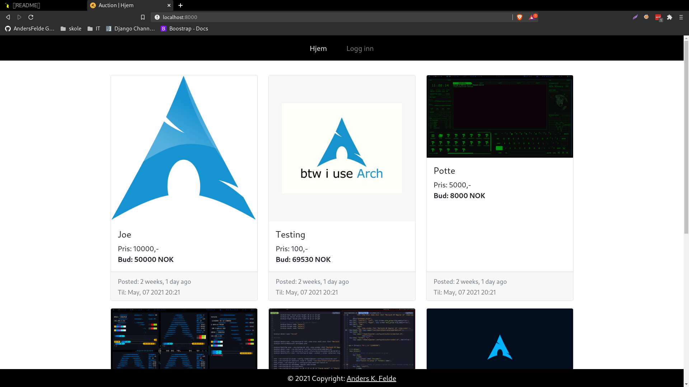

-   Oversikt over alle items
-   Trykker man på noen av items må man logge inn

#### Login

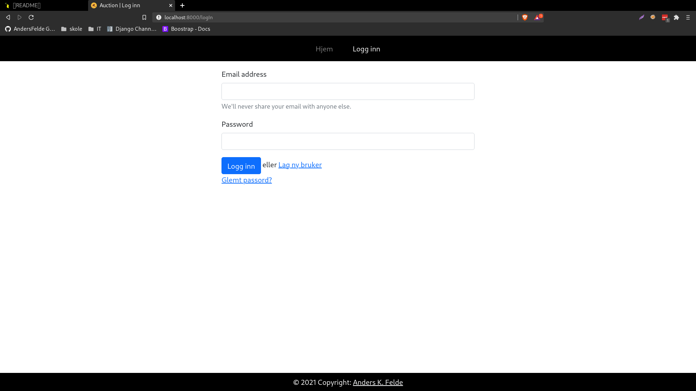

-   Logger inn med email og passord
-   Får tilbakemelding hvis passord og/eller email var feil
-   Har du ikke en bruker kan du gå inn på _Lag ny bruker_

#### Lag ny bruker

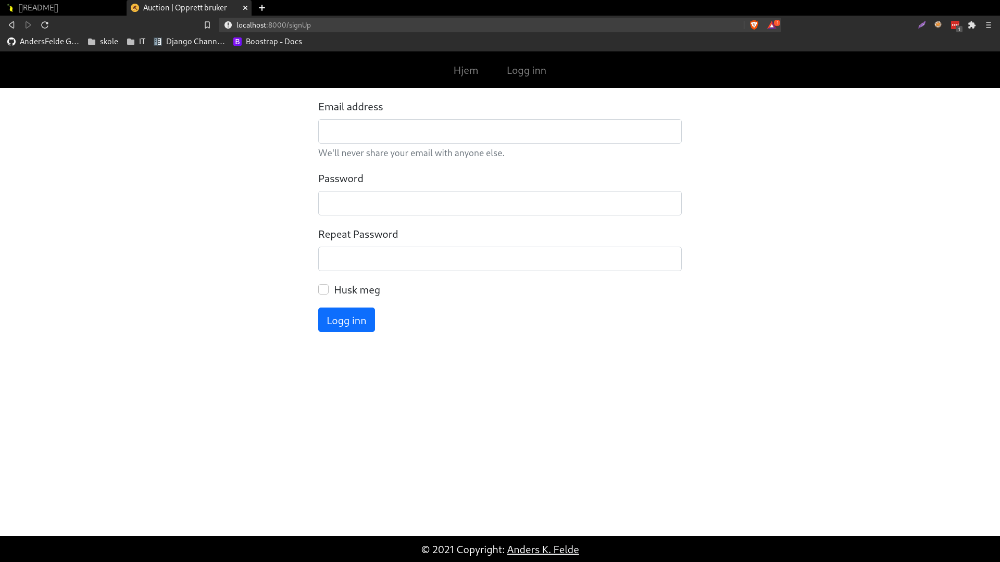

-   Må skrive inn email, og to like passord
-   Huker du av _Husk meg_ så vil du automatisk bli logget inn
    -   Hvis ikke vil du bli sendt til login igjen
-   Får tilabakemelding hvis passordene ikke stemmer

### Når man er logget inn

#### Navbar

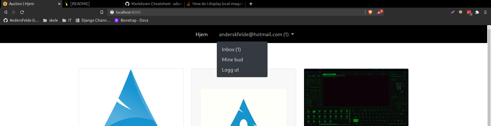

-   Hjem --> landing page
-   Brukernavn --> Dropdown
    -   Uleste varsler er evt markert med _(x)_
    -   Inbox _(x)_
    -   Mine bud
    -   Logg ut

#### Landing page

-   Oversikt over alle items
    -   Ser om du har høyeste bud, hva høyeste bud er og hvis det ikke er noe bud
-   Klikk på item for å by

#### Item page

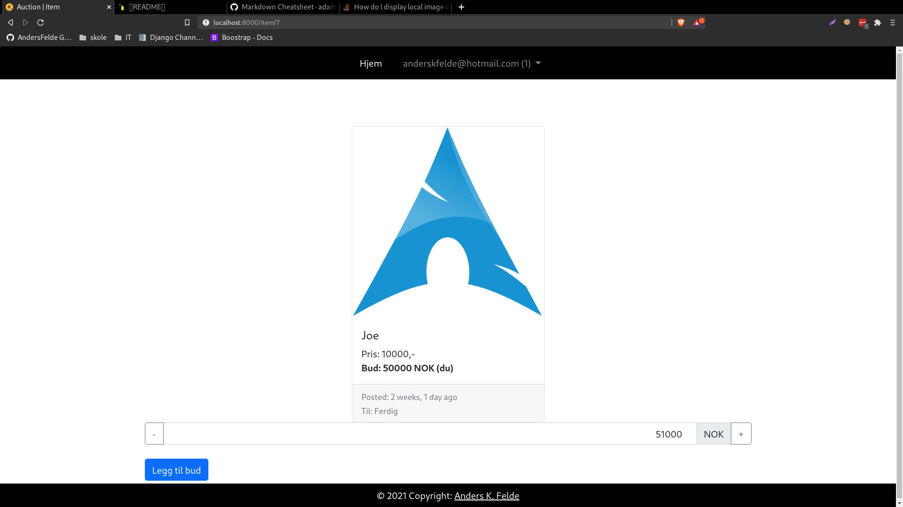

-   Neste bud er automatisk gammelt bud + 10% av originalpris
    -   Pluss og minus -knappene automatisk legger til/trekker fra 10% av originalpris
-   Trykk på Legg til bud for å legge til bud
    -   Popup for å verifisere at budet blir lagt inn
    -   Budet blir verifisert og du får tilabkemelding hvis det blir/ikke ble lagt inn
        -   Får evt informasjon om hva som var feil

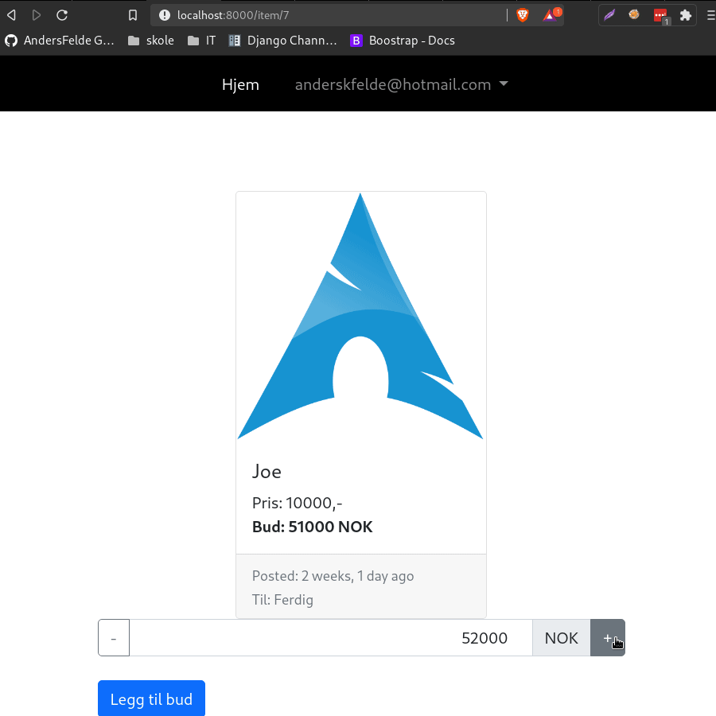

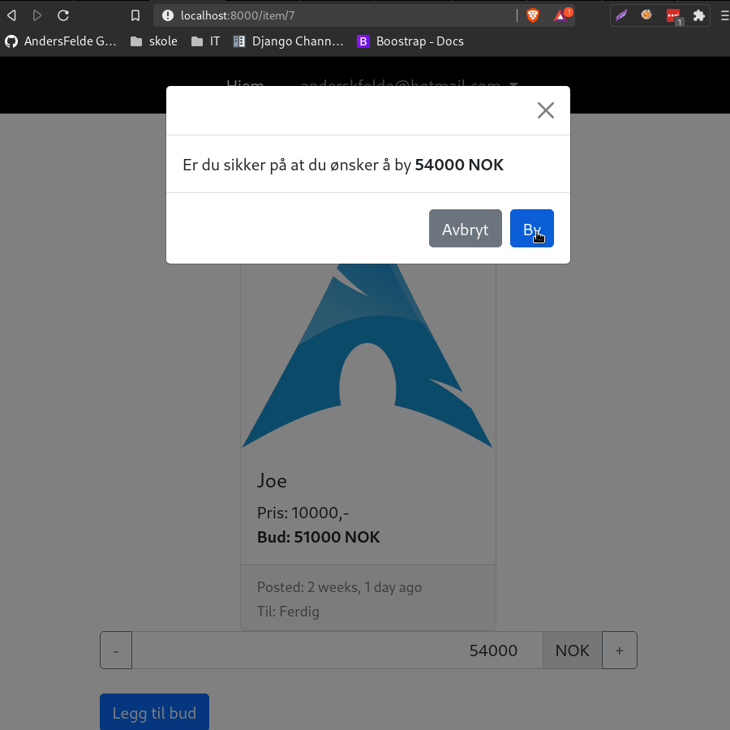
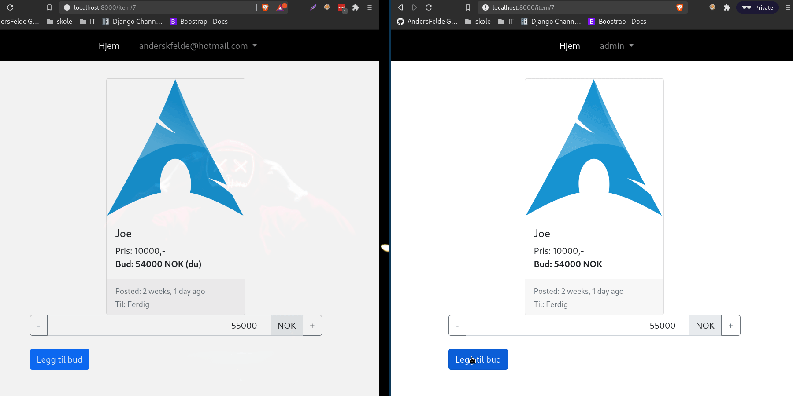

#### Inbox

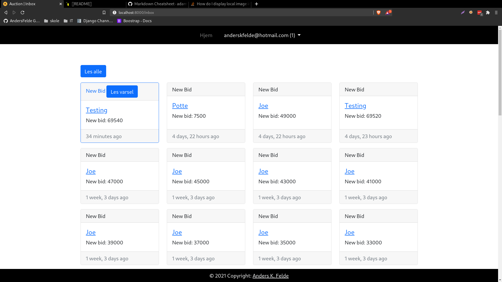
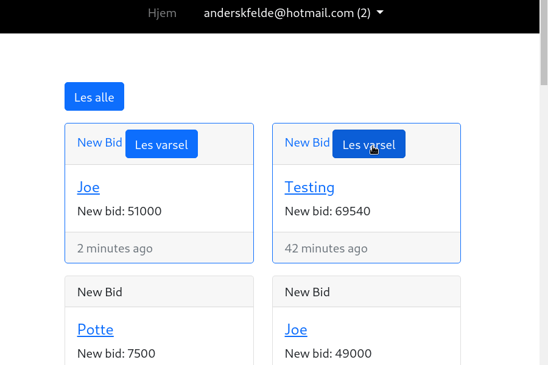

-   Oversikt over alle varsler
-   Sortert etter evt uleste
    -   uleste markert med blå kant
-   Lese varsler
    -   Trykke på et enkelt varsel
    -   Trykke på "Les alle" for å lese alle varsler

#### Mine bud

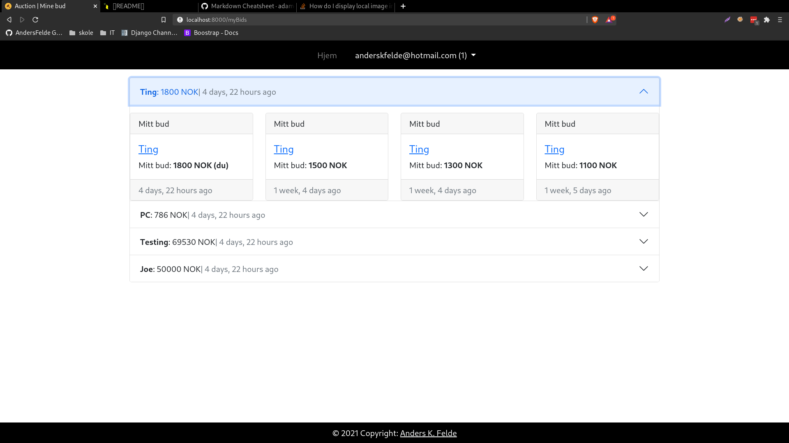

-   Sortert i grupper etter item
-   Viser ditt siste høyeste bud i item og hvor lenge siden
    -   Viser evt hvis du har høyeste bud

## Teknisk

#### Item

-   Pris _Originalpris_
-   Bud
    -   Hvis det ikke finnes bud "N/A"
    -   Høyeste bud, hvis det er ditt er det markert med **(du)**
-   Viser når det er posted, konvertert til tid-siden med "django humanize"
-   Viser fristen på bud som dato og klokkeslett

#### Varsler

-   Varlser kommer live gjennom bruken av websockets
    -   Alle verifiserer at bruker er logget inn før de får koble til/gjøre noe
-   På alle sider er man koblet til en notificationConsumer
    -   Gir notification hvis du blir overbydd uavhengig av hvilken side
    -   Henter hvor mange uleste varsler brukeren har på startup
    -   Leser notifications live fra inbox-siden
    -   Leter etter js function "handleNotification"
        -   Gjør at index oppdaterer (du) hvis du blir overbydd
        -   Gjør også at notification tallet (x) blir oppdatert live i navbar
-   På item page blir man koblet til bidConsumer
    -   Bid blir sendt gjennom consumer
        -   Verifisert backend
    -   Får notification hvis når det kommer nytt bud
        -   Oppdaterer bid i item og neste bid med aktuell verdi

#### Verfisering

-   Verfisering skjer gjennom django sitt system, så burde være relativt sikkert
-   Alle consumere verifiserer alt backend
-   Sider blir sjekket om du er logget inn, og evt redirected hvis du ikke skal være der
    -   Feks kan man ikke gå på "Logg inn" etter at man har logget inn
    -   Bruker django message system for å lage notification
-   Opprette bruker
    -   Verfisert at det er en email og at passordene stemmer backend
